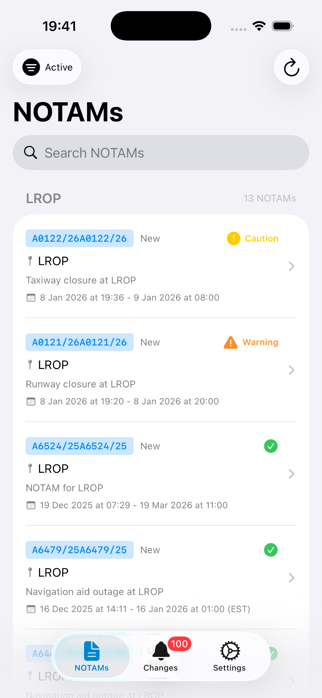
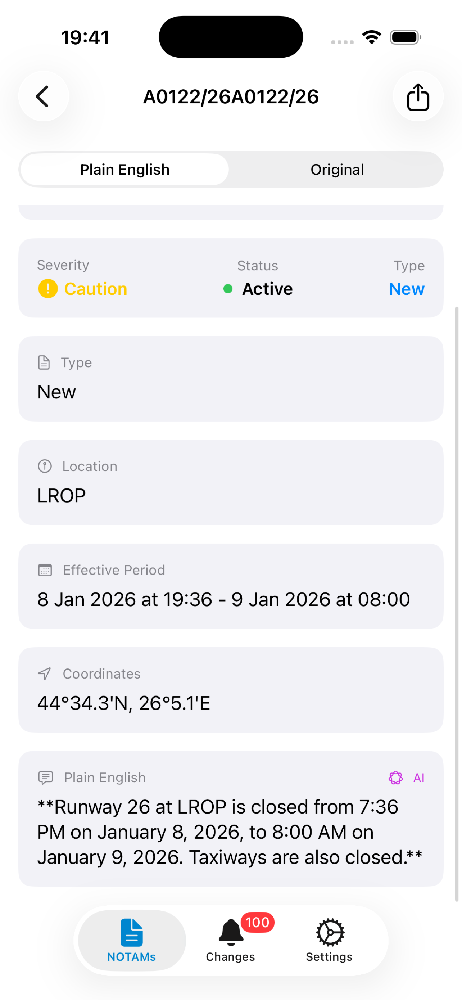

# NOTAM App

<p align="center">
  
</p>

<p align="center">
  <strong>Know What's Happening In The Sky</strong><br>
  Track airspace closures, flight restrictions, and aviation notices in your area.
</p>

<p align="center">
  <a href="https://eovidiu.github.io/NOTAM-App/">Website</a> •
  <a href="https://eovidiu.github.io/NOTAM-App/support.html">Support</a> •
  <a href="https://github.com/eovidiu/NOTAM-App/issues">Issues</a>
</p>

---

## About

NOTAM App delivers real-time Notice to Air Missions (NOTAMs) directly to your iOS device. Whether you're a drone operator, aviation enthusiast, researcher, or just curious about airspace activity in your area — this app keeps you informed.

**This app is for everyone**, not just pilots. No aviation background required.

## Features

- **Multi-Region Monitoring** — Track multiple Flight Information Regions (FIRs) simultaneously
- **Smart Severity Indicators** — Color-coded alerts (Critical, Warning, Caution, Info) help you spot what matters
- **Critical Notifications** — Get instant push notifications for airspace closures
- **Plain Language Translation** — 100+ aviation abbreviations translated to readable English
- **Change Tracking** — See what's new, modified, or cancelled
- **Background Refresh** — Data stays current automatically
- **Offline Support** — Cached data available without connection
- **Dark Mode** — Optimized for any lighting condition

## Screenshots

<p align="center">
  
  
  
</p>

## Requirements

- iOS 17.0+
- Xcode 15.0+
- Swift 5.9+

## Installation

1. Clone the repository:
   ```bash
   git clone https://github.com/eovidiu/NOTAM-App.git
   cd NOTAM-App
   ```

2. Copy the local configuration template:
   ```bash
   cp NOTAMApp/Local.xcconfig.example NOTAMApp/Local.xcconfig
   ```

3. Edit `NOTAMApp/Local.xcconfig` and add your Apple Developer Team ID:
   ```
   DEVELOPMENT_TEAM = YOUR_TEAM_ID_HERE
   ```

4. Open the project in Xcode:
   ```bash
   open NOTAMApp/NOTAMApp.xcodeproj
   ```

5. Build and run on your device or simulator.

## Project Structure

```
NOTAMApp/
├── Models/          # Data models (NOTAM, FIR, AppSettings)
├── Services/        # Business logic (API, caching, notifications)
├── Views/           # SwiftUI views
│   ├── NOTAM/       # NOTAM list and detail views
│   ├── Changes/     # Change tracking views
│   ├── Settings/    # Settings and FIR management
│   └── Components/  # Reusable UI components
└── Resources/       # Assets, FIR database
```

## Data Source

NOTAM data is fetched from the FAA NOTAM Search API, which provides publicly available aviation notices.

## Contributing

Contributions are welcome! Please feel free to submit issues or pull requests.

- 🐛 [Report a Bug](https://github.com/eovidiu/NOTAM-App/issues/new?labels=bug&title=[Bug]+)
- 💡 [Request a Feature](https://github.com/eovidiu/NOTAM-App/issues/new?labels=enhancement&title=[Feature]+)
- ❓ [Ask a Question](https://github.com/eovidiu/NOTAM-App/issues/new?labels=question&title=[Question]+)

## License

This project is licensed under the MIT License - see the [LICENSE](LICENSE) file for details.

## Disclaimer

This app is for informational purposes only. Always verify information through official sources before making any operational decisions.
